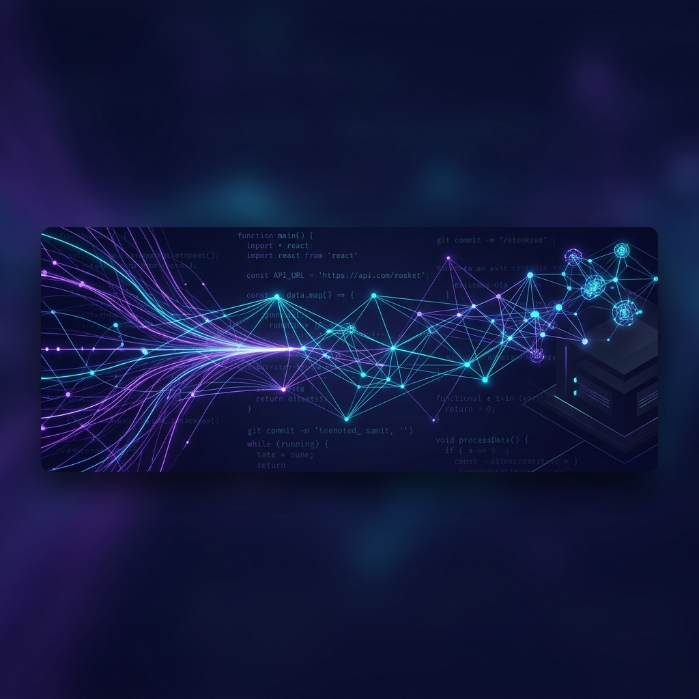

# 
👋 Hi, I'm Folorunso Tolulope

  

 

  

---

<table>
  <tr>
    <td width="50%" valign="top">
      <h3>🚀 About Me</h3>
      
I am a passionate software developer with a strong background in web and mobile development. I thrive on turning innovative ideas into practical solutions and enjoy working with a variety of technologies. My goal is to create meaningful, user-centric, and highly optimized applications that solve real-world problems.

      
With expertise spanning from frontend frameworks like React and Next.js to backend systems and mobile platforms like React Native, I focus on building responsive and seamless user experiences.

      
⚡ <strong>Fun Fact:</strong> Did you know that I love exploring new technologies and coding challenges? 💻

    </td>
    <td width="50%" valign="top" align="center">
      
        
      
    </td>
  </tr>
</table>

---

## 🛠️ Technical Skills

<table>
  <tr>
    <td valign="top" width="50%">
      <h4>🤖 AI Engineering & Integration</h4>
      
      
      
      
    </td>
    <td valign="top" width="50%">
      <h4>💻 Languages & Core</h4>
      
      
      
      
      
    </td>
  </tr>
  <tr>
    <td valign="top" width="50%">
      <h4>🌐 Web & Frontend</h4>
      
      
      
      
    </td>
    <td valign="top" width="50%">
      <h4>⚙️ Backend & Database</h4>
      
      
      
      
    </td>
  </tr>
  <tr>
    <td valign="top" width="50%">
      <h4>📱 Mobile & Tools</h4>
      
      
      
      
      
    </td>
    <td valign="top" width="50%">
      <h4>⚙️ Methodologies</h4>
      
      
      
    </td>
  </tr>
</table>

---

## 📁 Featured Projects

<table width="100%">
  <tr>
    <td width="50%" valign="top">
      <h4>🏢 dzuelsFoundation</h4>
      
Integrated Library System using Next.js framework.

      

        
        
        
      

      <a href="https://github.com/Tolufolorunso/dzuelsFoundation">💻 Code Repository</a> | <a href="https://dzuelsfoundation.vercel.app/">🔗 Live Application</a>
    </td>
    <td width="50%" valign="top">
      <h4>📰 TV360 Nigeria</h4>
      
Cross-platform news application for 360news built using React Native.

      

        
        
      

      <a href="https://github.com/Tolufolorunso/TV360_Nigeria">💻 Code Repository</a>
    </td>
  </tr>
  <tr>
    <td width="50%" valign="top">
      <h4>🖼️ Image Processing API</h4>
      
High-performance image processing REST API serving resized images. Built with sharp and Jasmine testing.

      

        
        
        
      

      <a href="https://github.com/Tolufolorunso/image_processing_api">💻 Code Repository</a>
    </td>
    <td width="50%" valign="top">
      <h4>🐦 Tweeter</h4>
      
Responsive Twitter-inspired front-end interface built from scratch following Devchallenges specifications.

      

        
        
        
      

      <a href="https://github.com/Tolufolorunso/Tweeter">💻 Code Repository</a>
    </td>
  </tr>
  <tr>
    <td width="50%" valign="top">
      <h4>🛒 Storefront API (Udacity)</h4>
      
Robust RESTful backend API for an e-commerce storefront, developed as a Udacity Capstone project.

      

        
        
        
      

      <a href="https://github.com/Tolufolorunso/storefront_API_Udacity">💻 Code Repository</a>
    </td>
    <td width="50%" valign="top">
      <h4>📝 staybusys</h4>
      
Intuitive and responsive task management application built with the Angular framework.

      

        
        
      

      <a href="https://github.com/Tolufolorunso/staybusys">💻 Code Repository</a>
    </td>
  </tr>
</table>

---

## 🏆 Certifications & Credentials

<table width="100%">
  <tr>
    <!-- Cert 1: IBM AI Developer -->
    <td width="50%" valign="top" style="border: 1px solid #30363d; padding: 12px; border-radius: 6px;">
      
      <h4>🤖 IBM AI Developer Specialization</h4>
      
Comprehensive training on building, testing, and deploying GenAI-powered applications.

      

        
🔍 <strong>View skills & curriculum</strong>

        <ul>
          <li>Generative AI & Prompt Engineering</li>
          <li>Python for AI & Application Development</li>
          <li>Building AI Apps with OpenAI & Watson APIs</li>
          <li>Integrating LLMs & Vector Databases</li>
        </ul>
      

       
      
    </td>
    <!-- Cert 2: AI Engineering -->
    <td width="50%" valign="top" style="border: 1px solid #30363d; padding: 12px; border-radius: 6px;">
      
      <h4>🧠 AI Engineering Specialization</h4>
      
Advanced machine learning, deep learning, and neural network engineering.

      

        
🔍 <strong>View skills & curriculum</strong>

        <ul>
          <li>Supervised & Unsupervised Machine Learning</li>
          <li>Deep Learning with TensorFlow & PyTorch</li>
          <li>Computer Vision & Natural Language Processing (NLP)</li>
          <li>Building & Fine-tuning Neural Network Models</li>
        </ul>
      

       
      
    </td>
  </tr>
  <tr>
    <!-- Cert 3: IBM Full Stack Software Developer -->
    <td width="50%" valign="top" style="border: 1px solid #30363d; padding: 12px; border-radius: 6px;">
      
      <h4>💻 IBM Full Stack Developer Specialization</h4>
      
Professional end-to-end full stack web development & cloud deployment training.

      

        
🔍 <strong>View skills & curriculum</strong>

        <ul>
          <li>Front-end: HTML5, CSS3, JavaScript, React</li>
          <li>Back-end: Node.js, Express, Python Django</li>
          <li>Cloud & DevOps: Docker, Kubernetes, Microservices</li>
          <li>Continuous Integration & Deployment (CI/CD)</li>
        </ul>
      

       
      
    </td>
    <!-- Cert 4: Meta Full Stack Developer -->
    <td width="50%" valign="top" style="border: 1px solid #30363d; padding: 12px; border-radius: 6px;">
      
      <h4>🌐 Meta Full Stack Developer Specialization</h4>
      
Frontend & Backend development from scratch, designed by Meta experts.

      

        
🔍 <strong>View skills & curriculum</strong>

        <ul>
          <li>Modern Web Layouts & React Development</li>
          <li>Server-side scripting with Python & Django</li>
          <li>Relational Databases, APIs & Security</li>
          <li>Deployment, Version Control (Git) & Agile workflows</li>
        </ul>
      

       
      
    </td>
  </tr>
  <tr>
    <!-- Cert 5: Meta React Native -->
    <td width="50%" valign="top" style="border: 1px solid #30363d; padding: 12px; border-radius: 6px;">
      
      <h4>📱 Meta React Native Specialization</h4>
      
Premium cross-platform mobile application development specialization.

      

        
🔍 <strong>View skills & curriculum</strong>

        <ul>
          <li>React Native & Expo Ecosystem</li>
          <li>Mobile UI Design, Navigation & Layouts</li>
          <li>Consuming REST APIs on Mobile Devices</li>
          <li>App Store Deployment & Testing</li>
        </ul>
      

       
      
    </td>
    <!-- Cert 6: Infosec JS Security -->
    <td width="50%" valign="top" style="border: 1px solid #30363d; padding: 12px; border-radius: 6px;">
      
      <h4>🔒 Infosec JavaScript Security Specialization</h4>
      
Advanced security practices for modern JavaScript web applications.

      

        
🔍 <strong>View skills & curriculum</strong>

        <ul>
          <li>Web Vulnerabilities (OWASP Top 10)</li>
          <li>Securing Node.js Backends & APIs</li>
          <li>Preventing XSS, CSRF, and SQL Injection</li>
          <li>Dependency Auditing & Secure SDLC</li>
        </ul>
      

       
      
    </td>
  </tr>
  <tr>
    <!-- Cert 7: Google IT Support -->
    <td width="50%" valign="top" style="border: 1px solid #30363d; padding: 12px; border-radius: 6px;">
      
      <h4>🛠️ Google IT Support Professional</h4>
      
Foundational IT support, networking, operating systems, and security.

      

        
🔍 <strong>View skills & curriculum</strong>

        <ul>
          <li>Troubleshooting & Customer Support Fundamentals</li>
          <li>Computer Networking & DNS Configuration</li>
          <li>System Administration (Windows & Linux)</li>
          <li>IT Infrastructure Security & Active Directory</li>
        </ul>
      

       
      
    </td>
    <!-- Cert 8: Udacity Front-End -->
    <td width="50%" valign="top" style="border: 1px solid #30363d; padding: 12px; border-radius: 6px;">
      
      <h4>🌐 Udacity Front-End Web Developer</h4>
      
Responsive, performant, and dynamic web application development.

      

        
🔍 <strong>View skills & curriculum</strong>

        <ul>
          <li>HTML5 Layouts & Advanced CSS (Flexbox/Grid)</li>
          <li>JavaScript & Web APIs / DOM Manipulation</li>
          <li>Build Tools & Webpack Configuration</li>
          <li>Service Workers & Progressive Web Apps (PWA)</li>
        </ul>
      

       
      
    </td>
  </tr>
  <tr>
    <!-- Cert 9: Udacity React Developer -->
    <td width="50%" valign="top" style="border: 1px solid #30363d; padding: 12px; border-radius: 6px;">
      
      <h4>⚛️ Udacity React Developer Nanodegree</h4>
      
Advanced React architecture, global state management, and mobile React Native.

      

        
🔍 <strong>View skills & curriculum</strong>

        <ul>
          <li>React Component Architecture & Hooks</li>
          <li>Redux & Context API for State Management</li>
          <li>React Native Mobile App Development</li>
          <li>Asynchronous React Actions & APIs</li>
        </ul>
      

       
      
    </td>
    <!-- Cert 10: Udacity Full Stack Developer -->
    <td width="50%" valign="top" style="border: 1px solid #30363d; padding: 12px; border-radius: 6px;">
      
      <h4>🔌 Udacity Full Stack Developer Nanodegree</h4>
      
Database modeling, security, authentication, and backend server deployment.

      

        
🔍 <strong>View skills & curriculum</strong>

        <ul>
          <li>Relational Databases & PostgreSQL / SQLAlchemy</li>
          <li>API Development, Documentation & Testing</li>
          <li>Identity Access Management (Auth0 & OAuth 2.0)</li>
          <li>Docker Containerization & Server Deployment</li>
        </ul>
      

       
      
    </td>
  </tr>
</table>

---

## 📬 Connect with Me

  
  
  
  
  

 

  Thank you for visiting! 😊

